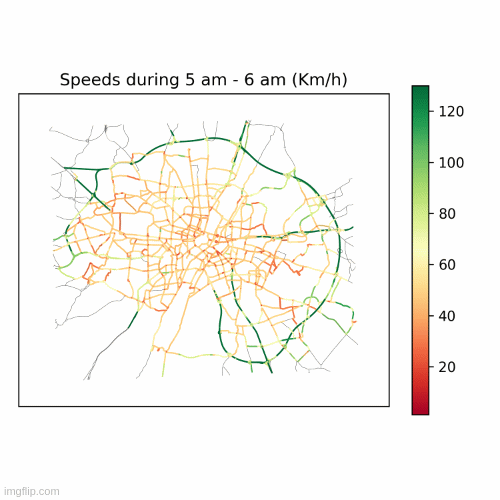
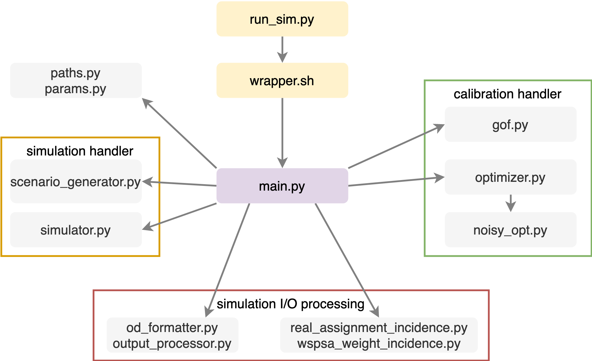

# actrys (Automated Calibration for TRaffic Simulations)

[](https://github.com/vishalmhjn/actrys/actions/workflows/main.yml)

<b>actrys</b> is a Python-based platform to calibrate the traffic simulations in SUMO.

<p align="center">

</p>

<p align="center">

</p>

## Overview

This repository contains code for:

- Input/ Ouptut interfaces to call SUMO, initialize and simulate the scenarios, and collect the output data.
- Calibration components:
  - Optimization strategy: SPSA, W-SPSA, Bayesian optimization
  - Goodness-of-fit criterias
- Assignment matrix extraction based on the simulated routes
- Synthetic simulator with a static traffic assignment for prototyping.
- Utilities
  - Preparing and processing SUMO input files such as network downloading, trip filtering, adding detectors, file format conversion
  - Plotting

## Framework

The platform implements a step-wise approach for sequential calibration of

- Demand parameters or Origin-Destination (OD) flows
- Supply parameters for a mesoscopic simulation

To achieve this, following process is followed:

- Bias-correction in OD matrix using one-shot heuristic
- Bayesian optimization to fine-tune SPSA parameters using analytical or static assignment matrix approximated from the simulator
- W-SPSA with ensembling techniques with cold and warm restarts
- Supply calibration using Bayesian optimization

Currently, the platform can handle link based Measures of Performance (MOP) such as link traffic counts and link speeds in the calibration.

This platform can calibrate two kinds of scenarios:

- <b>Analytical or static simulator: </b> This is used for prototyping. Here, the assignment matrix is a randomly generated matrix. This random assignment matrix is controlled by different parameters and maps the OD flows to link counts. No external file or data are needed to run this scenario, except few parameters which control the scenario properties.
- <b>Black-box or dynamic simulator: </b> SUMO is used in this scenario. The simulation encompasses:
  - Creation of trips from time-dependent OD matrices
  - Routing for the trips based on the route-choice algorithm
  - Dynamic network conditions, traffic propagation and re-routing

## Architecture

<p align="center">

</p>

## Input preparation for SUMO simulations

<b>Black-box or dynamic simulator </b> scenarios need quite-a-few formatted inputs. Example file are provided in [munich](munich/).

- **Network file**: Standard SUMO network [(example)](munich/network.net.xml)
- **OD matrices**: Time-dependent specification of trips between Origin-Destination zones. [(example)](munich/demand/)
- **Link sensors**: File specifying the properties (location, frequency of data collection) of edge or link sensors [(example)](munich/additional.add.xml)
- **Traffic Analysis Zones**: Mapping between origin-destination zones and network edges [(example)](munich/tazes.taz.xml)

## Custom Synthetic Scenario with SUMO

For a custom synthetic scenario, this process is followed:

- A true demand is simulated to obtain "_real sensor measurements_".
- Subsequently, the true demand is perturbed by addition of bias and variance.
- Perturbed demand is simulated and corressponding simulation sensor measurements are compared with the "\_real sensor measurements". Based on the discrepancy between real and simulated, the calibrator aims to recover the true demand matrix.

## Custom Real Scenario with SUMO

For a real scenario, we use real counts from sensor measurements. These measurements could be open data from traffic operator website or city's open data portals. In this case, additonal input is needed to use the observed counts as an input:

- **Observed sensor data** such as link volumes or link speeds to be used as MOP [(example)](munich/realdata.csv).
  _todo_
- In a real-scenario, true demand is not known. What we have is a initial demand matrix, which is simulated and corressponding simulation sensor measurements are compared with the real sensor measurements. Based on the discrepancy between real and simulated, the calibrator aims to recover the true demand matrix.

## Requirements

- The framework has been tested on **SUMO 1.13.0** and **Python 3.8** on both Ubuntu 18.04 and macOS 13.2. You should create a [virtual environment](https://packaging.python.org/en/latest/guides/installing-using-pip-and-virtual-environments/#installing-virtualenv) using
  ```sh
  cd
  python3 -m venv actrys
  ```
- Then activate the virtual environment using
  ```sh
  source ~/actrys/bin/activate
  ```
- Make the github repository your current directory:
  ```sh
  cd path/to/your/github/repository
  ```
- Install the Python [requirements](requirements.txt) using:
  ```sh
  pip install -r requirements.txt
  ```

## Execution

Following procedure for running <b>Analytical or static simulation </b> scenarios.

- Set the current working director to [src/wrapper](src/wrapper/) in the Command line interface, as above.

- The Python file is the overall wrapper [run_analytical_sim.py](src/wrapper/run_analytical_sim.py), which calls the [synthetic_calibrator.py](src/core/synthetic_calibrator.py).

- Run the following in terminal:
  ```sh
  python runAnalyticalSim.py
  ```
- Outputs are stored in [synthetic_sims](synthetic_sims/) folder

Following procedure for running <b>Black-box or dynamic simulation </b> scenarios with synthetic counts:

- First, [paths](src/core/paths.py) and [parameters](src/core/params.py) are to be specified. The platform has not been tested on Windows OS, so the Paths might need to be adapted.

- Set path to the SUMO folder with SUMO_HOME variable. for example in OSX, it is generally stored at following path for SUMO version 1.10.0. You can check the this [link](https://sumo.dlr.de/docs/Basics/Basic_Computer_Skills.html#sumo_home) for more details.

  ```sh
  export SUMO_HOME="/usr/local/Cellar/sumo/1.10.0/share/sumo"
  ```

- Then, the current working director should be changed to [src/wrapper](src/wrapper/) in the Command line interface. You can set this from home directory by

  ```sh
  cd src/wrapper
  ```

- The Python file is the overall wrapper [run_sim.py](src/wrapper/run_sim.py), which calls the secondary wrapper [wrapper.sh](src/wrapper/wrapper.sh). Run the following in terminal:
  ```sh
  python runSim.py munich
  ```
- Outputs are stored in [munich](munich/) folder

Following procedure for running <b>Black-box or dynamic simulation </b> scenarios with real-world counts:

- Specify the paths to real data in the [wrapper.sh](src/wrapper/wrapper.sh). For example:

  ```sh
  export FILE_MATCH_DETECTORS=../../$SCENARIO/sample_real_world_data/matchable_detectors.csv
  export FILE_REAL_COUNTS=../../$SCENARIO/sample_real_world_data/dummy_counts_data.csv
  export FILE_REAL_SPEEDS=../../$SCENARIO/sample_real_world_data/dummy_speed_data.csv
  ```

- Specify the detector identifier in the [params](src/core/params.py) as per the [detector file](munich/additional.add.xml) (_<e1Detector id=""_).

  ```
  additonal_identifier = "e1Detector_id"
  output_identifier = "interval_id"
  ```

- Finally, run the following in terminal to run the **Munich** scenario:
  ```sh
  python runSim.py munich
  ```

## Citation

If you use these codes in your work, kindly cite the following preprint:

Mahajan, V., Cantelmo, G., and Antoniou, C, One-shot heuristic and ensembling for automated calibration of large-scale traffic simulations, [preprint](https://mediatum.ub.tum.de/doc/1701188/1701188.pdf), 2023.

## Acknowledgements

1. SUMO: https://github.com/eclipse/sumo
2. Noisyopt library: https://github.com/andim/noisyopt

## Disclaimer

The codebase is being improved for readability and execution. Please excuse the prototypical nature of the platform.
