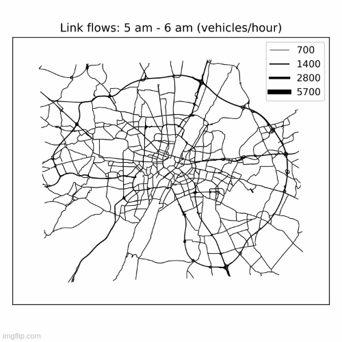

# actrys (Automated Calibration for TRaffic SImulations)
Copyright 2020-2023 Vishal Mahajan

<b>actrys</b> is a Python-based platform to calibrate the traffic simulations in SUMO. 

## Overview
This repository contains code for:
* Input/ Ouptut interfaces to call SUMO, initialize and simulate the scenarios, and collect the output data.
* Calibration components:
    * Optimization strategy: SPSA, W-SPSA, Bayesian optimization
    * Goodness-of-fit criterias
* Assignment matrix extraction based on the simulated routes
* Synthetic simulator with a static traffic assignment for prototyping.
* Utilities
    * Preparing and processing SUMO input files such as network downloading, trip filtering, adding detectors, file format conversion
    * Plotting

## Framework
The platform implements a step-wise approach for sequential calibration of
* Demand parameters or Origin-Destination (OD) flows
* Supply parameters for a mesoscopic simulation

To achieve this, following process is followed:
* Bias-correction in OD matrix using one-shot heuristic
* Bayesian optimization to fine-tune SPSA parameters using analytical or static assignment matrix approximated from the simulator
* W-SPSA with ensembling techniques with cold and warm restarts
* Bayesian optimization using supply calibration

Currently, the platform can handle link based Measures of Performance (MOP) such as link traffic counts and link speeds in the calibration.

This platform can calibrate two kinds of scenarios:
* <b>Analytical or static simulator: </b> This is used for prototyping. Here, the assignment matrix is a randomly generated matrix. This random assignment matrix is controlled by different parameters and maps the OD flows to link counts. No external file or data are needed to run this scenario, except few parameters which control the scenario properties.
* <b>Black-box or dynamic simulator: </b> SUMO is used in this scenario. The simulation encompasses:
    * Creation of trips from time-dependent OD matrices
    * Routing for the trips based on the route-choice algorithm
    * Dynamic network conditions, traffic propagation and re-routing
## Input preparation
<b>Black-box or dynamic simulator </b> scenarios need quite-a-few formatted inputs
* Network file: Standard SUMO network
* OD matrices inputs: Time-dependent specification of trips between Origin-Destination zones
* Link sensor file inputs: File specifying the properties (location, frequency of data collection) of edge or link sensors
* Traffic Analysis Zone file: Mapping between origin-destination zones and network edges
* Observed sensor data such as link volumes or link speeds to be used as MOP

## Execution

_todo_

<!-- ## Analytical or static simulator

## SUMO simulator -->

## Citation
If you use these codes in your work, kindly cite the following working paper:

Mahajan, V., Cantelmo, G., and Antoniou, C, One-shot heuristic and ensembling for automated calibration of large-scale traffic simulations, Working Paper, 2023.

## Acknowledgements
1. SUMO: https://github.com/eclipse/sumo
2. Noisyopt library: https://github.com/andim/noisyopt
